Crypto currency has really been taking off over the past few years with the explosion of NFTs and the rise in price and 
acceptance of Bitcoin. A very cool thing in crypto land that is taking off is called a DAO (Decentralized Autonomous Organizations).

These are organizations controlled by organization members, and they are not influenced by central authorities. All
the rules of the organization exist in code, and the code is only changed based on approval from the majority of the members.

Many projects have been popping up that give crazy high interest rates on your investments into their DAO. Two very popular ones are 
[Time Wonderland](https://app.wonderland.money/) and [Olympus DAO](https://www.olympusdao.finance/).

Who knows if these will last the test of time, and their wildly high interest rates make them hard to ignore.

# How To Buy Titano
Titano is based on the BNB Smart Chain network, so I recommend using the [Trust Wallet](https://trustwallet.com/).

>If you don't want to purchase BNB Smart Chain from the Trust Wallet, you can also buy BNB from Binance.US and send it to
> your wallet
> 
>[Sign up for/log in to Binance.US](https://accounts.binance.us/en/register?ref=53597299)
> 
> *Please note, if you haven't used Binance before, after purchasing crypto you have to wait 10 days before you can send it to your wallet!!!*
 
## Steps
1. Open [Trust Wallet](https://trustwallet.com/)
2. Tap Smart Chain 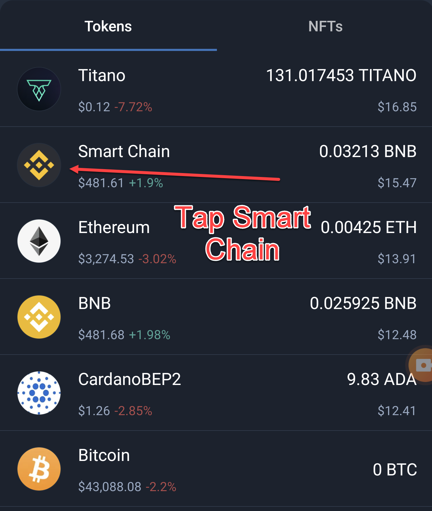
3. Buy Smart Chain 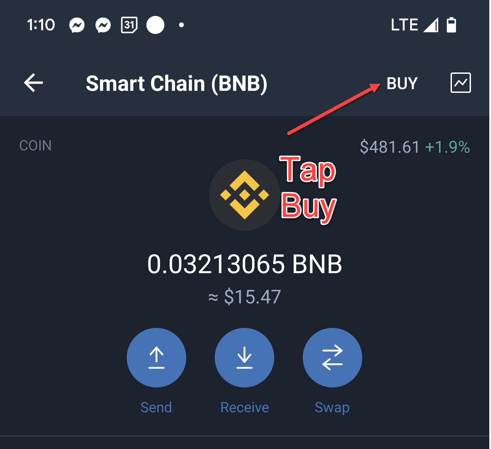
4. Enter your amount, pick a provider, and pay (You will have to use a debit card) 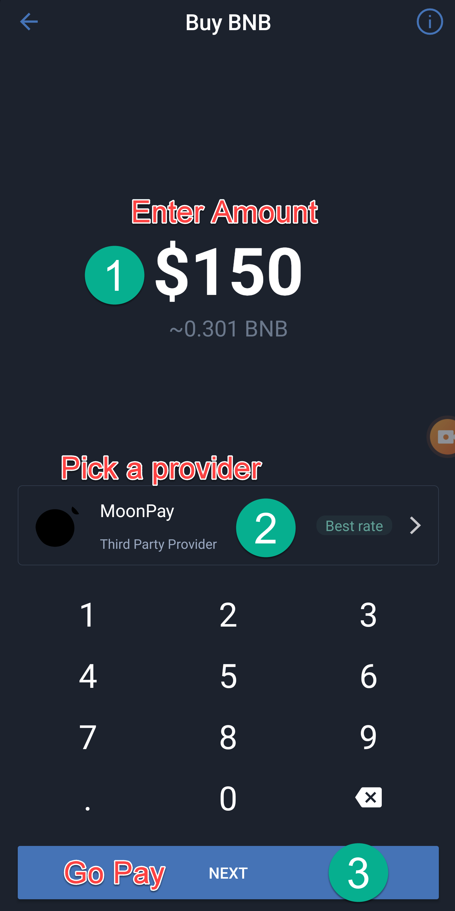
5. Make a payment 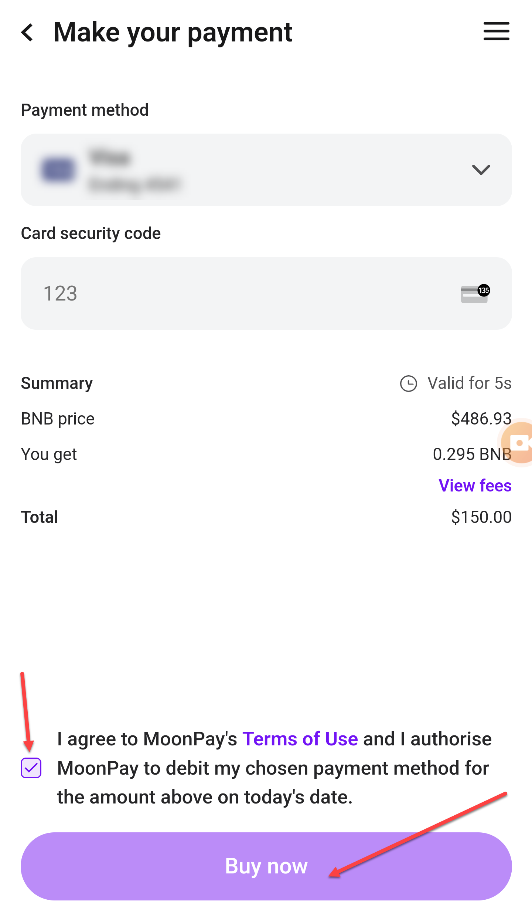
6. Go into DApps on Trust Wallet and visit **titano.finance** 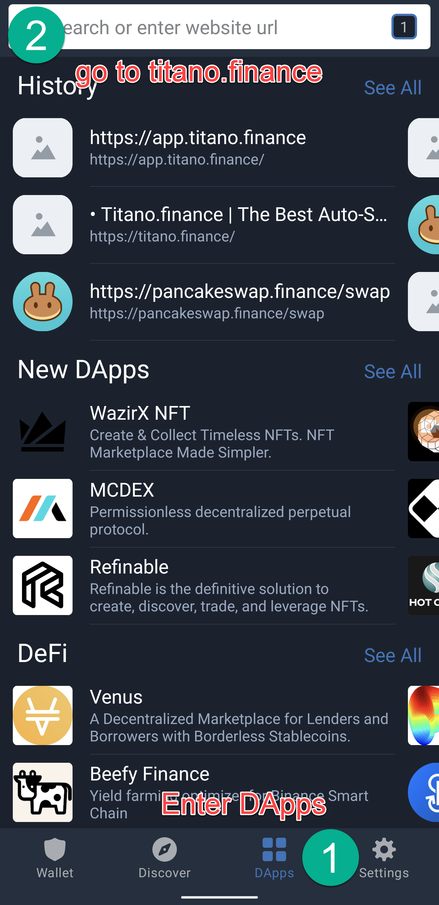
7. Tap **Buy Titano** 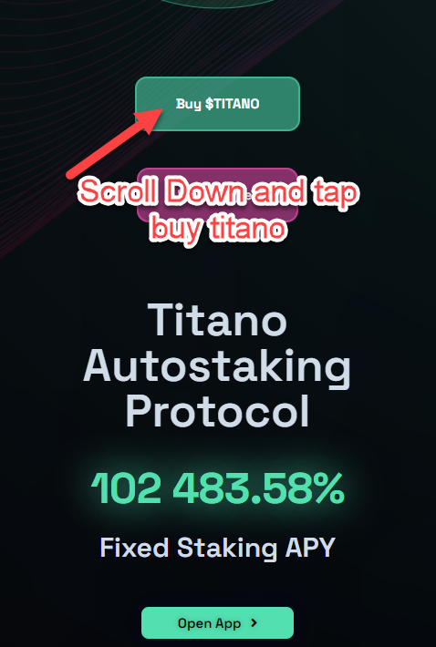 
8. Import the token 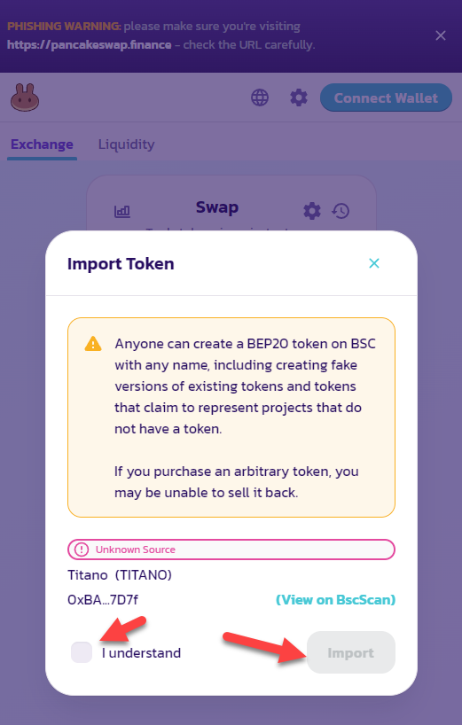
9. 
   - Connect your wallet
   - go into the swap settings, set the slippage tolerance to 14%
   - enter how much BNB you want to exchange (Keep a little for gas fees!)
   - then remove the decimals off of the Titano total 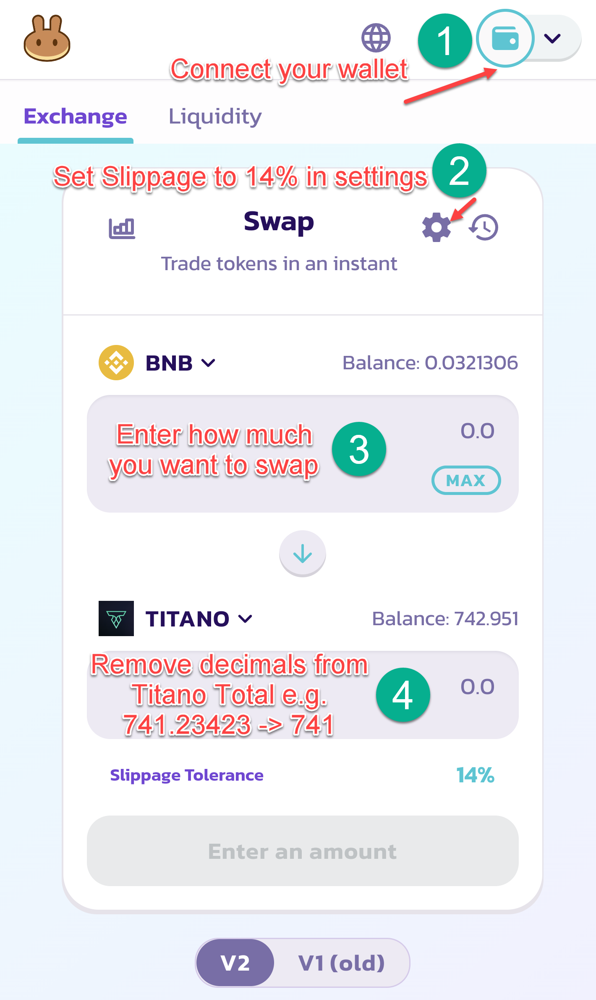
9b. Here is where you set the slippage in the swap settings 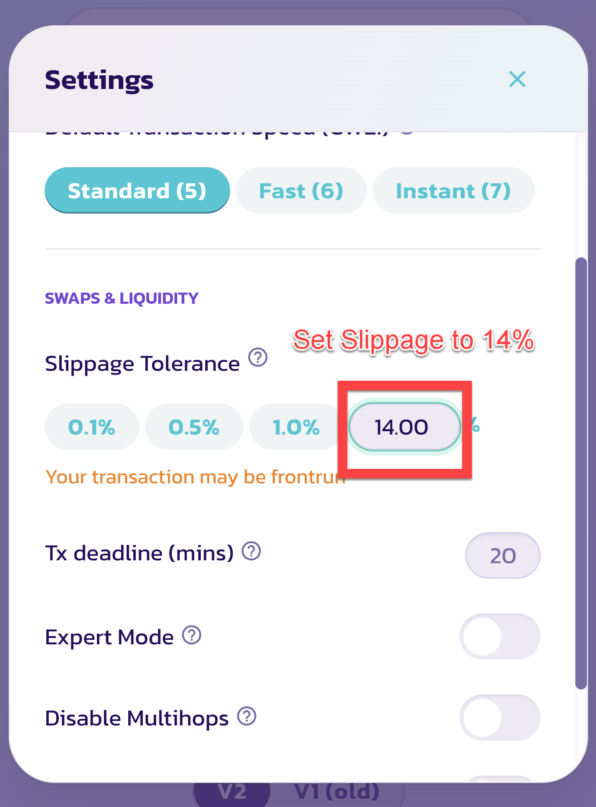
10. Swap and Confirm 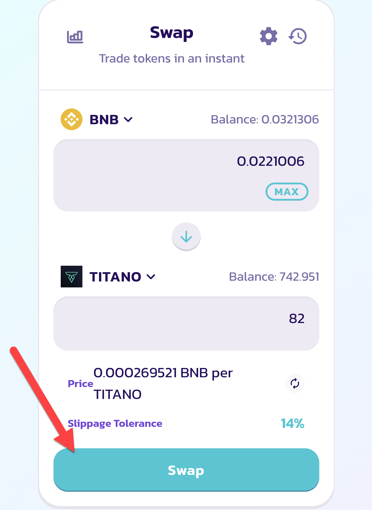
11. Visit app.titano.finance to view your balance 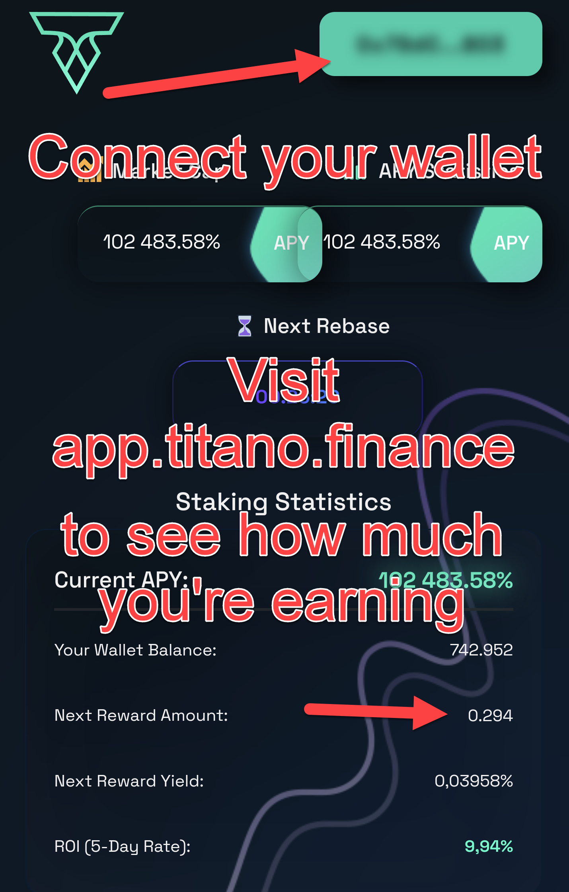

## You're Done!
That is it! The fun thing about this project is that once you purchase Titano, it automatically starts compounding! 
You can watch your balance grow right from your wallet!